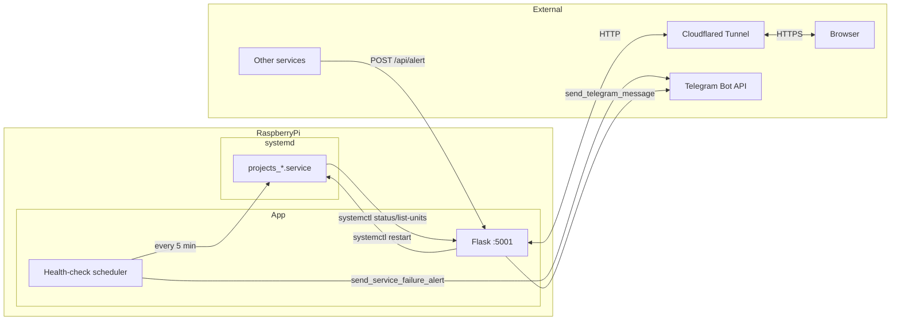

# Service Monitor

Web dashboard for monitoring and managing systemd services on a Raspberry Pi.

## Screenshot


## Tech Stack

`Python 3.12, Flask, systemd/systemctl, vanilla JS, Inter (Google Fonts)`

## Architecture


```mermaid
flowchart LR
    subgraph RaspberryPi
        subgraph systemd
            SVC1[projects_*.service]
        end
        subgraph App
            Flask[Flask :5001]
            Sched[Health-check scheduler]
        end
    end
    subgraph External
        CF[Cloudflared Tunnel]
        Browser[Browser]
        Other[Other services]
        TG[Telegram Bot API]
    end

    SVC1 -->|systemctl status/list-units| Flask
    Flask -->|systemctl restart| SVC1
    Flask <-->|HTTP| CF
    CF <-->|HTTPS| Browser
    Sched -->|every 5 min| SVC1
    Sched -->|send_service_failure_alert| TG
    Other -->|POST /api/alert| Flask
    Flask -->|send_telegram_message| TG
```

**Data Flow:**
1. Flask queries systemd for services matching `projects_*` pattern
2. Parses status output for uptime, memory, CPU, errors
3. Renders dashboard; sidebar details loaded async via `/api/services/sidebar-details`
4. Live logs streamed via SSE at `/logs/stream` (journalctl -f)
5. Restart commands sent via `sudo systemctl restart`
6. Background scheduler checks health every 5 minutes; failed services send Telegram alerts via `send_service_failure_alert` (rate-limited per service: `hourly` / `daily` / `muted`)
7. Other apps can POST custom Markdown alerts to `/api/alert` (always sends; no auth)
8. Dashboard home polls `/api/system-info` every 10s for host vitals (temp, CPU, memory, disk, uptime)
9. A background sampler (`system_metrics.py`) polls host vitals at 1Hz and, on each 30s flush, also samples per-service RAM/CPU (`systemctl show MemoryCurrent,CPUUsageNSec`). Both are persisted to `system_metrics.db` (7-day retention). The dashboard history chart reads host series from `/api/system-info/history`; the service-detail view reads per-service series from `/api/services/history`

## Prerequisites

- Python 3.12+
- uv (Python package manager)
- systemd (Linux)
- `sudo` access for service restarts
- Cloudflared (for external access)

## Installation

1. Clone and enter the repo:
   ```bash
   cd ~/service-monitor
   ```

2. Copy and fill out the env file:
   ```bash
   cp .env.example .env
   # Edit .env with your credentials
   ```

3. Run the install script:
   ```bash
   cd install
   ./install.sh
   ```

4. Configure sudoers (required for restart functionality):
   ```bash
   # Add to /etc/sudoers.d/service-monitor
   mnalavadi ALL=(ALL) NOPASSWD: /usr/bin/systemctl restart projects_*
   ```

## Running

**Via systemd (production):**
```bash
sudo systemctl start projects_service-monitor.service
```

**Manual (development):**
```bash
uv run src/app.py
```

**Default URL:** `http://localhost:5001`
**External URL:** `https://service-monitor.mnalavadi.org` (via Cloudflared)

## Project Structure

```
service-monitor/
├── src/
│   ├── app.py          # Flask app — all routes and request handling
│   ├── services.py     # systemd querying, ServiceStatus parsing, CI status
│   ├── scheduler.py    # Background health check + per-service alert frequency; starts the metrics sampler
│   ├── system_metrics.py # 1Hz host + 30s per-service metric sampler; SQLite persistence + history queries
│   ├── telegram.py     # Shared Telegram transport; service-failure message formatting
│   ├── canned_info.py  # Static website links + canned ServiceStatus fixtures for dev/testing
│   ├── values.py       # Loads secrets from .env (python-dotenv)
│   └── config.py       # CLI tool that reads pyproject.toml config values
├── templates/
│   └── index.html      # Main dashboard template (Jinja2)
├── static/
│   ├── app.css         # Full stylesheet (custom CSS, design tokens)
│   ├── main.js         # Module bootstrap
│   ├── ui-shell.js     # Sidebar open/close, hamburger, keyboard nav
│   ├── services-list.js # Service list: search, auto-refresh, project colors
│   ├── log-stream.js   # SSE log streaming, filtering (time/count/severity/text), spike chart, traceback grouping + highlight
│   ├── sidebar-details.js # Async sidebar status/CI enrichment + alert frequency UI
│   ├── system-info.js  # Dashboard home: polls /api/system-info, renders vitals grid
│   ├── chart-utils.js  # Shared stateless helpers for both metric charts
│   ├── system-metrics-chart.js  # Dashboard-home host history chart (4 series, /api/system-info/history)
│   ├── service-metrics-chart.js # Service-detail per-service RAM/CPU chart (/api/services/history)
│   └── notifications.js # ARIA live region announcements
├── tests/
│   ├── test_app.py
│   ├── test_scheduler.py
│   ├── test_telegram.py
│   ├── test_services.py
│   ├── test_system_metrics.py
│   └── test_config.py
├── install/
│   ├── install.sh
│   └── projects_service-monitor.service
├── alert_settings.json # Persisted per-service alert frequencies (created at runtime)
├── system_metrics.db   # SQLite time series for host + per-service metrics (created at runtime)
├── .env.example        # Template for required environment variables
├── pyproject.toml
└── cloudflared/
    └── config.yml
```

## Environment Variables

Copy `.env.example` to `.env` and fill in values:

| Variable | Required | Description |
|---|---|---|
| `TELEGRAM_API_TOKEN` | Yes | Telegram bot token for failure + custom alerts |
| `TELEGRAM_CHAT_ID` | Yes | Telegram chat ID to send alerts to |
| `GITHUB_TOKEN` | No | GitHub PAT for CI status; unauthenticated rate limit applies if omitted |
| `INSPECTOR_DETECTOR_UV_PATH` | No | Path to `uv` binary on Pi (default: `/home/mnalavadi/.local/bin/uv`) |
| `INSPECTOR_DETECTOR_CWD` | No | Working directory for inspector-detector check (default: `/home/mnalavadi/inspector_detector`) |

## API Endpoints

| Endpoint | Method | Description |
|---|---|---|
| `/` | GET | Dashboard view, lists all `projects_*` services |
| `/?service=<name>` | GET | Dashboard with status header + live log stream for selected service |
| `/restart` | POST | Restart a service (validated against known services) |
| `/logs/stream` | GET (SSE) | Server-sent events stream of journalctl output for a service |
| `/api/services/sidebar-details` | GET | JSON: enriched status + CI for all services (loaded async after first paint) |
| `/api/system-info` | GET | JSON: host (Pi) vitals — temperature, CPU, memory, disk, uptime |
| `/api/system-info/history` | GET | JSON: windowed host vitals time series for the dashboard chart (`window`, `rollup` params) |
| `/api/services/history` | GET | JSON: one service's RAM/CPU time series for the detail-view chart (`service`, `window`, `rollup` params) |
| `/api/alert` | POST | Send a custom Telegram alert (Markdown `message`; no auth/rate limit) |
| `/api/alert-settings` | GET | Per-service alert frequencies (`hourly` / `daily` / `muted`) |
| `/api/alert-settings` | POST | Update one service’s alert frequency |
| `/inspector-detector/check` | POST | Run Inspector Detector inspection check (service-specific) |

### POST `/restart`

**Request:**
```
Content-Type: application/x-www-form-urlencoded
service=projects_example.service
```
**Validation:** Service name must exist in `systemctl list-units projects_*`. Returns 400 for unknown services.
**Response:** Redirects to `/?service=<name>` on success, 400/500 on error.

### GET `/logs/stream`

SSE stream. Each event is a JSON-encoded log line string:
```
data: "2026-05-04T14:52:57+0200 hostname service[pid]: log line here"
```
Client reconnects automatically on disconnect with exponential backoff.

### GET `/api/services/sidebar-details`

Returns:
```json
{
  "services": [
    {
      "name": "projects_foo.service",
      "is_active": true,
      "is_failed": false,
      "uptime": "2d 3h",
      "memory": "123.4M",
      "cpu": "2min 15s",
      "last_error": null,
      "ci_status": "success"
    }
  ]
}
```

### GET `/api/system-info`

Host vitals read live from `/proc` and `/sys` (stdlib only, no extra deps). Polled by the
dashboard home view every 10s. Any field is `null` when its source is unavailable (e.g. running
off-Pi); in dev mode the route returns `canned_system_info`.

```json
{
  "hostname": "raspberrypi",
  "uptime": "6d 14h",
  "temperature_c": 52.6,
  "cpu_percent": 12.4,
  "load_avg": 0.42,
  "cpu_count": 4,
  "memory_used_mb": 1840,
  "memory_total_mb": 3886,
  "memory_used_pct": 47.3,
  "disk_used_pct": 38.0,
  "disk_used_gb": 44.7,
  "disk_total_gb": 117.6
}
```

Sources: `temperature_c` from `/sys/class/thermal/thermal_zone0/temp`; `cpu_percent` sampled over
~100ms from `/proc/stat`; `memory_*` from `/proc/meminfo`; `uptime` from `/proc/uptime`;
`load_avg`/`cpu_count` and `disk_*` via stdlib (`os`, `shutil`), so they populate cross-platform.

### GET `/api/system-info/history`

Windowed host vitals time series for the dashboard-home chart. Read from `system_metrics.db`
(the `system_samples` table). Off-Pi the route returns a synthetic `canned_history`.

- `window`: `1h` | `6h` | `24h` | `7d` (default `7d`). `400` for other values.
- `rollup`: `30s` | `2m` | `10m` | `30m` (default `30s`) — server-side time-bucket averaging. `400` for other values.

```json
{
  "window": "24h",
  "rollup": "2m",
  "samples": [
    {"ts": 1720000000.0, "temperature_c": 52.6, "cpu_percent": 12.4, "memory_used_pct": 47.3, "disk_used_pct": 38.0,
     "temperature_c_max": 55.1, "cpu_percent_max": 40.2, "memory_used_pct_max": 49.0, "disk_used_pct_max": 38.1}
  ]
}
```

### GET `/api/services/history`

One service's RAM/CPU time series for the chart in the service-detail view (between the status header
and the live logs). Read from the `service_samples` table. Off-Pi the route returns synthetic data.

- `service` (required): full unit name; on Linux it must be a known `projects_*` unit (`400` otherwise).
- `window` / `rollup`: same values and defaults as `/api/system-info/history`.

```json
{
  "service": "projects_foo.service",
  "window": "24h",
  "rollup": "2m",
  "samples": [
    {"ts": 1720000000.0, "service": "projects_foo.service", "memory_used_mb": 123.4, "cpu_percent": 3.2}
  ]
}
```

`memory_used_mb` is `MemoryCurrent` (cgroup RSS) in MiB; `cpu_percent` is the `CPUUsageNSec` delta over
the sample interval, normalized by core count. `cpu_percent` is `null` on a service's first sample
(no prior counter to diff) and after a restart (counter reset).

### POST `/api/alert`

Send a custom Telegram alert from another service. No auth; always sends (caller controls spam).
Uses the same Telegram transport as failure alerts (`send_telegram_message` in `src/telegram.py`) with
`parse_mode=Markdown` (caller supplies valid Markdown).

**Request:**
```json
{
  "message": "*Backup failed* on `projects_foo.service`"
}
```

**Response:**
```json
{"ok": true}
```
`400` if `message` is missing/empty (`{"ok": false, "error": "..."}`); `502` if Telegram delivery fails.

### GET/POST `/api/alert-settings`

Per-service alert frequency for the background health-check scheduler. Default for unknown services is
`hourly`. Frequencies: `muted` (never), `hourly` (at most once per hour), `daily` (once per reset window
starting at `ALERT_RESET_HOUR`, default 6 AM).

**GET response:**
```json
{
  "projects_foo.service": "hourly",
  "projects_bar.service": "muted"
}
```

**POST request:**
```json
{
  "service": "projects_foo.service",
  "frequency": "daily"
}
```

**POST response:** `{"ok": true}` on success; `400` for missing service or invalid frequency.

## Key Concepts

| Concept | Description |
|---|---|
| `projects_*` | Naming convention for monitored services; only services matching this pattern are displayed |
| `ServiceStatus` | Dataclass holding parsed service info: name, is_active, is_failed, uptime, memory, cpu, last_error, ci_status |
| Status indicators | Green = active (running), Red = failed, Gray = inactive |
| Project groups | Services sharing the same base name (e.g. `projects_energy-monitor_*`) are visually grouped in the sidebar |
| CI status | Fetched from GitHub Actions API for services without a suffix; cached 60s per repo |
| Telegram alerts | One transport (`send_telegram_message`); service failures use `send_service_failure_alert`; custom messages use `POST /api/alert` |
| Alert frequency | Per-service `muted` / `hourly` / `daily`; persisted in `alert_settings.json`; last-sent times kept in memory |
| Metrics sampler | One background thread (`system_metrics.py`): host vitals at 1Hz, flushed as a 30s avg+max row; per-service RAM/CPU sampled on the same 30s flush. Linux-only (no-op off-Pi). Started by `start_scheduler` |
## Data Models

```
ServiceStatus
├── name: str              # Full service name (e.g. "projects_foo.service")
├── is_active: bool        # True if "active (running)" in systemctl status
├── is_failed: bool        # True if "active: failed" in systemctl status
├── uptime: str | None     # Parsed from "Active: ... since ...; X ago"
├── memory: str | None     # Parsed from "Memory: X"
├── cpu: str | None        # Parsed from "CPU: X"
├── last_error: str | None # Parsed from "Error: X"
├── full_status: str       # Raw systemctl status output
├── project_group: str     # Base name parsed from service name
├── suffix: str | None     # Sub-service suffix (e.g. "data-backup-scheduler")
└── ci_status: str | None  # "success" | "failure" | "error" | None
```

Metric time series persisted in `system_metrics.db` (SQLite, 7-day retention, pruned on each write):

```
system_samples  (host vitals, one row per 30s window; avg + max of the 1Hz ticks)
├── ts REAL PRIMARY KEY
├── temperature_c / cpu_percent / memory_used_pct / disk_used_pct           REAL   # window average
└── temperature_c_max / cpu_percent_max / memory_used_pct_max / disk_used_pct_max  REAL   # window max

service_samples  (per-service vitals, one row per service per 30s window)
├── (ts REAL, service TEXT)   PRIMARY KEY
├── memory_used_mb   REAL   # MemoryCurrent (cgroup RSS) in MiB
└── cpu_percent      REAL   # CPUUsageNSec delta / interval / core count; null on first sample or after restart
```

## Storage / Persistence

- Live service state (status, CI) is read from systemd, not stored.
- Metric time series (host + per-service RAM/CPU) persisted in `system_metrics.db` (see Data Models); 7-day retention.
- Service list cached in-process for 5 seconds.
- CI status cached in-process for 60 seconds per repo.
- Alert frequencies persisted in `alert_settings.json` (written on change).
- Last-alert timestamps kept in-memory only (lost on restart); daily window resets at `ALERT_RESET_HOUR`.
- Custom `POST /api/alert` messages are not rate-limited or persisted.

## Configuration

| Variable | Location | Default | Description |
|---|---|---|---|
| `host` | `src/app.py` | `0.0.0.0` | Bind address |
| `port` | `src/app.py` | `5001` | HTTP port |
| `service_pattern` | `src/services.py` | `projects_*` | systemctl filter pattern |
| `DEFAULT_ALERT_FREQUENCY` | `src/scheduler.py` | `hourly` | Default frequency when a service has no saved setting |
| `ALERT_RESET_HOUR` | `src/scheduler.py` | `6` | Hour (local time) at which the daily alert window resets |
| Health-check interval | `src/scheduler.py` | 5 minutes | How often failed services are scanned for Telegram alerts |

## Deployment

**systemd unit file:** `install/projects_service-monitor.service`

```ini
[Unit]
Description=Service Monitor
After=multi-user.target

[Service]
WorkingDirectory=/home/mnalavadi/service-monitor
Type=idle
ExecStart=/home/mnalavadi/.local/bin/uv run src/app.py
User=mnalavadi

[Install]
WantedBy=multi-user.target
```

**Cloudflared:** Configured via `add_cloudflared_service.sh` to expose on `service-monitor.mnalavadi.org`.

## External Dependencies

| Service | Purpose | Auth |
|---|---|---|
| systemd | Service management | Local system |
| Cloudflared | HTTPS tunnel | Cloudflare account |
| Telegram Bot API | Failure + custom alerts | Bot token in `.env` |
| GitHub Actions API | CI status badges | PAT in `.env` (optional) |

## Known Limitations

- Inspector Detector check endpoint is hardcoded to a specific service name and configured via `INSPECTOR_DETECTOR_*` env vars
- No authentication on web interface or `POST /api/alert`
- Requires sudo for restart functionality (must configure sudoers)
- Only monitors services matching `projects_*` pattern
- Log streaming only works on Linux (journalctl); dev mode shows placeholder
- Last-alert dedupe state is in-memory; process restart can re-send a failure alert sooner than the configured window
